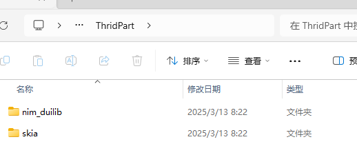
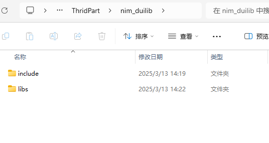
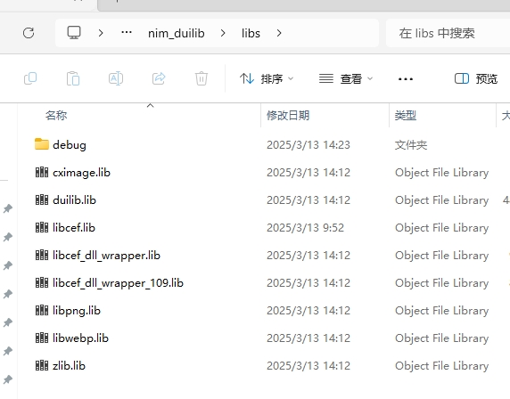
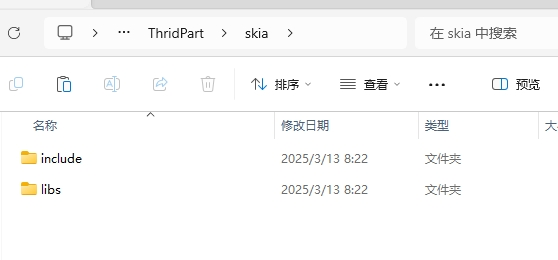
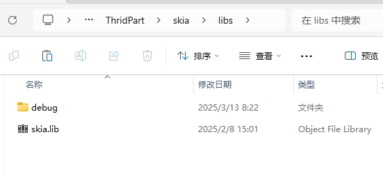
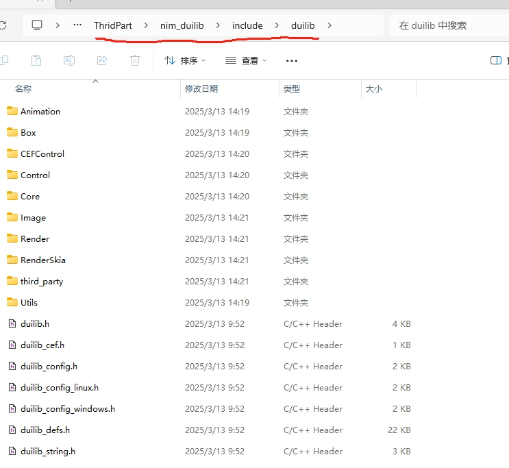
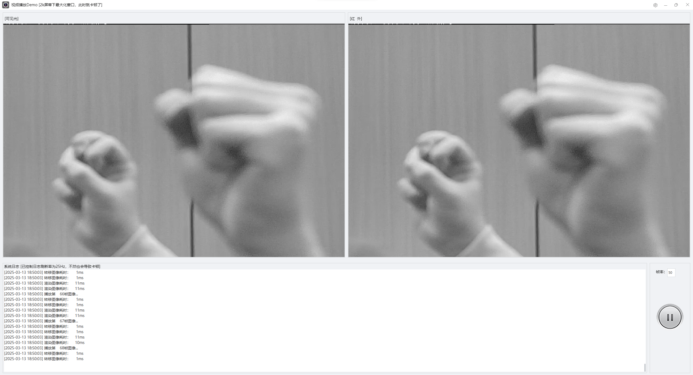

# VideoPlayerDemo
Win64 C++ 视频播放器测试代码，基于nim-duilib[skia]开发

## 第三方包结构
项目路径/ThridPart/

项目路径/ThridPart/nim_duilib/include下面则是 duilib 头文件。skia不需要头文件

## 效果

## 优化
本项目就是传上来给nim__duilib检查图像刷新性能问题的，解决刷新卡顿，提升刷新率。

nim_duilib: https://github.com/rhett-lee/nim_duilib